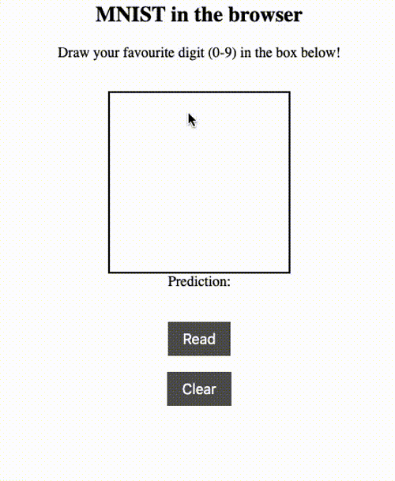

# MNIST in the browser

Recognise hand-written digits in the browser!

## What is this?

MNIST, a dataset of handwritten digits, is the *Hello World* of machine learning.
The goal of this mini project was to learn how to deploy a machine learning model
in the browser. The model was trained from scratch using TensorFlow and is
loaded in the browser using Tensorflow.js. 

This was a warmup for my next project in which I made a game of snake
controllable by moving your head!
<a href="https://github.com/paruby/snake-face">See here.</a>
